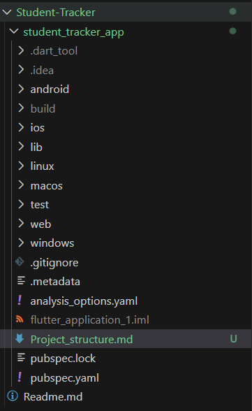

# Flutter Folder Structure Exploration – Student Tracker App

This assignment explores the complete Flutter project structure and explains the purpose of each core folder and configuration file generated when initializing a Flutter project.

## 📂 Documentation

A detailed explanation of the project structure can be found in:

➡️ PROJECT_STRUCTURE.md

## 🖼 Folder Hierarchy Screenshot

(Insert your screenshot here)

## 💡 Reflection

Understanding Flutter’s folder structure is important because it helps developers maintain clean, scalable, and organized applications. A well-structured project improves teamwork, reduces confusion, and increases development speed by separating platform-specific code from business logic.

By exploring folders like lib/, android/, ios/, web/, and configuration files such as pubspec.yaml, I gained a clearer understanding of how Flutter connects Dart code with native platforms.

